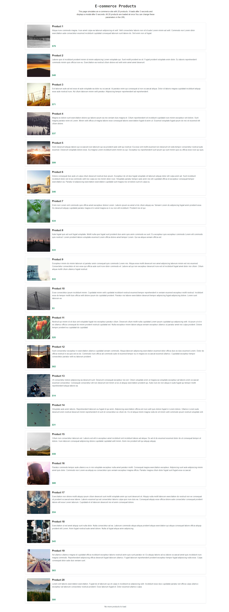

# Capture Screenshot

**Type:** `capture_screenshot`

Takes a screenshot of the current page. You can choose to take a full screen screenshot showing the whole page or just the current view.

### Parameters

<table data-full-width="false"><thead><tr><th width="212">Name</th><th width="130">Type</th><th width="108" data-type="checkbox">Required</th><th>Description</th></tr></thead><tbody><tr><td><code>size</code></td><td><code>string</code></td><td>false</td><td>The size of paper the page should be printed to. <br><strong>Default:</strong> <code>view</code><br><strong>Accepted</strong>: <code>["view", "fullscreen"]</code></td></tr></tbody></table>

See [universal parameters](./#universal-parameters).

### Usage

The following captures the current section of the page currently visible in the browser.

```json
"actions": [
    {
        "type": "capture_screenshot",
        "size": "view"
    }
]
```

### Example Output

An example screenshot in `fullscreen` mode.

<figure><figcaption></figcaption></figure>

