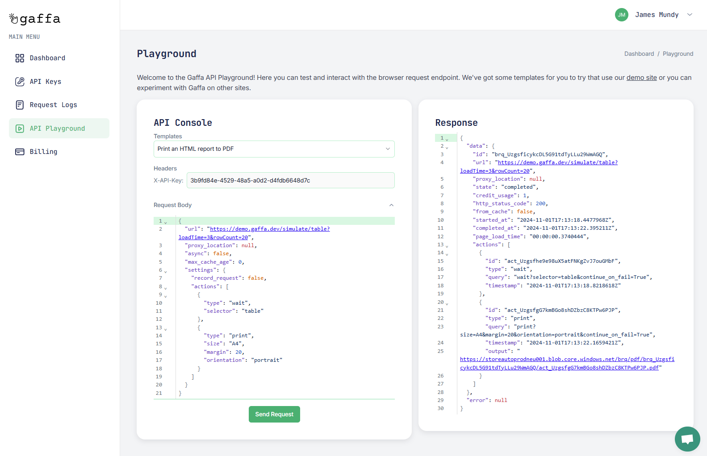

# Your First Request

You can get started straight away by using our [playground ](https://gaffa.dev/dashboard/playground)to make requests to the API. The playground has several examples of how you can use the API to automate a series of actions or scrape data using our [demo site](https://demo.gaffa.dev/) which simulates some common scenarios.

<figure><figcaption>
You can use the playground console to make live requests to the API
</figcaption></figure>

### Playground Scenarios

The playground features prebuild requests to our demo site which simulate the following scenarios:

* **Scraping an Ecommerce Storefront**\
  The demo site displays a determinate or infinite number of items with an optional cookie modal which simulate using the Gaffa API to scroll a ecommerce sites front page and capture a full page screenshot which could, for example, be queried using an AI image model. \
  This demo uses the following actions:&#x20;

